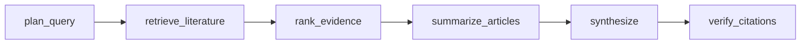

<!-- PROJECT LOGO -->
<br />
<div align="center">
  <h3 align="center">Medical Literature Research Agent</h3>

  <p align="center">
    A Python web app that answers clinical questions by searching PubMed, summarizing abstracts, and returning evidence-based answers with citations.
  </p>
</div>

<!-- ABOUT THE PROJECT -->
## About The Project

Medical Literature Research Agent helps users explore medical evidence through a simple web interface. Enter a clinical question in natural language, and the app searches PubMed, retrieves abstracts, summarizes the findings, and produces a final answer with inline citations and linked references.

It also supports optional filters, treatment comparison, session-based follow-up questions, PDF export, and ongoing trial lookup from ClinicalTrials.gov.


### Built With

* [![Python][Python.org]][Python-url]
* [![FastAPI][FastAPI.tiangolo.com]][FastAPI-url]
* [![LangGraph][LangGraph]][LangGraph-url]
* [![Groq][Groq.com]][Groq-url]
* [![Vercel][Vercel.com]][Vercel-url]
* [![React][React.js]][React-url]


<!-- GETTING STARTED -->
## Getting Started

### Prerequisites

* Python 3.10 or later
* A [Groq API key](https://console.groq.com) (**required**)

### Installation

1. Clone the repo
   ```sh
   git clone https://github.com/sanskritim05/medical-literature-research-agent.git
   ```
2. Create the environment file
   ```sh
   cp .env.example .env
   ```
3. Add your credentials to `.env`
   ```sh
   LLM_PROVIDER=groq
   GROQ_API_KEY=your_groq_api_key
   GROQ_MODEL=llama-3.1-8b-instant
   ```
4. Install dependencies
   ```sh
   pip install -r requirements.txt
   ```
5. Install frontend dependencies and build (or run Vite in a second terminal)
   ```sh
   cd web && npm install && npm run build && cd ..
   ```
6. Start the app
   ```sh
   uvicorn main:app --reload
   ```
7. Open in your browser
   ```text
   http://127.0.0.1:8000
   ```

For UI hot reload during development, run `uvicorn main:app --reload` and `cd web && npm run dev` (Vite proxies `/api` to the backend).


## Deploy on Vercel

This app is configured for Vercel’s FastAPI runtime (`main.py` + `vercel.json`).

1. Push the repo to GitHub and import it in [Vercel](https://vercel.com/new).
2. In **Project Settings → Environment Variables**, add:

   | Name | Required | Notes |
   |------|----------|--------|
   | `GROQ_API_KEY` | **Yes** | From [console.groq.com](https://console.groq.com) |
   | `LLM_PROVIDER` | Recommended | Set to `groq` |
   | `GROQ_MODEL` | Optional | Default `llama-3.1-8b-instant` |
   | `NCBI_API_KEY` | Optional | Free NCBI key helps avoid PubMed rate limits on shared IPs |
   | `NCBI_EMAIL` | Optional | Contact email for NCBI E-utilities etiquette |
   | `LANGSMITH_API_KEY` | Optional | Only if you enable LangSmith tracing |

3. Leave **Output Directory** blank in Vercel project settings (do not set it to `public`).
4. Deploy. Research requests can take a while; `vercel.json` sets `maxDuration` to **300 seconds**.

5. Or deploy from the CLI:
   ```sh
   npx vercel
   ```
   Then set the same env vars in the Vercel dashboard (or with `npx vercel env add`).

**Notes**
- Ollama is for local use only; do not set `LLM_PROVIDER=ollama` on Vercel.
- PubMed + ClinicalTrials.gov need no paid keys.
- Session memory is in-process (ephemeral on serverless). Browser history still works via `localStorage`.


<!-- USAGE -->
## Architecture

The API still accepts the same research requests and returns the same response fields. New fields are added alongside them: `query_plan`, `comparison_query_plan`, `rankings`, and `citation_audit`. Each reference also includes `rank_score` and `rank_reason`.



1. **plan_query** turns the question into PICO elements, a MeSH-style PubMed query, and a shorter fallback query. If that JSON fails validation, the existing rule-based query normalizer is used.
2. **retrieve_literature** searches PubMed with the planned query, then the fallback, then the rule-based query. ClinicalTrials.gov and the local cache still run in parallel when requested.
3. **rank_evidence** scores study design from PubMed publication-type metadata, plus overlap with the question and recency. Retracted articles are dropped. The search asks for systematic reviews and meta-analyses first, fetches up to 15 candidates, and keeps the top 4. In compare mode, numbering continues from the primary list into the comparison list.
4. **summarize_articles** extracts population, intervention, comparator, outcome, effect direction, and significance for each kept abstract, in parallel, with the PMID attached.
5. **synthesize** writes the final answer only from those structured summaries. It reports how many studies support the conclusion and calls out conflicting effect directions.
6. **verify_citations** drops citation numbers that do not match a retrieved article. A claim counts as supported only when the model quotes an exact sentence from the cited abstract. Unsupported claims are removed and the confidence score is lowered.

Groq `llama-3.1-8b-instant` is the default model. Set `GROQ_MODEL` to use another model.


## Evaluation

The harness is 20 clinical questions with well-established evidence grades.

```sh
pip install pytest
pytest tests/test_agent_pipeline.py
python eval/run_eval.py
```

`eval/run_eval.py` writes `eval/results.json`. Each question has a `reference_conclusion`. The script grades whether the answer reaches that conclusion and prints a sample of graded answers. Trials are off. The default model is `llama-3.1-8b-instant`. That ID was not in this account's Groq model list, so the recorded runs set `GROQ_MODEL=openai/gpt-oss-20b`.

| Metric | Baseline | After step 2 (same pipeline, plus correctness grade) |
| --- | --- | --- |
| Questions completed | 19 of 20 | 19 of 20 |
| Citation validity | 1.000 (27/27) | 1.000 (25/25) |
| Claim support | 0.926 (25/27) | 0.828 (24/29) |
| Average latency | 55.13 s | 50.18 s |
| Confidence label matches evidence grade | 0.211 (4/19) | 0.316 (6/19) |
| Answer correctness | not measured | 0.579 (11/19) |

Step 2 did not change retrieval or generation. The support-rate change is run-to-run variation. Retrieval, structured summaries, and the quote-checked verifier are in the code. The post-change eval is pending. `eval/results_baseline.json` and `eval/results_after_step2.json` hold the two rows above.


## Usage

1. Enter a clinical question in natural language.
2. Optionally select a study type or date range.
3. Run the search.
4. Review the final answer, inline citations, and linked references.
5. Optionally compare two treatments, simplify the answer, or export results as a PDF.


<!-- EXAMPLE QUESTIONS -->
## Example Questions

* In adults with acute low back pain, do NSAIDs improve pain and function compared with acetaminophen?
* For type 2 diabetes, do GLP-1 receptor agonists reduce cardiovascular events compared with standard care?
* In children with acute otitis media, when is watchful waiting appropriate compared with immediate antibiotics?
* Compare intratympanic steroids versus oral steroids for idiopathic sudden sensorineural hearing loss.


<!-- PROJECT STRUCTURE -->
## Project Structure

```text
medical-literature-research-agent/
├── main.py
├── agent.py
├── pubmed_tool.py
├── eval/
│   ├── questions.json
│   ├── run_eval.py
│   └── results.json
├── tests/
│   └── test_agent_pipeline.py
├── web/                 # Evidentia React UI (Vite + plain CSS)
│   ├── src/
│   │   └── styles.css
│   └── package.json
├── vercel.json
├── pyproject.toml
├── .env.example
├── .gitignore
├── requirements.txt
└── README.md
```

`frontend_dist/` is generated by `cd web && npm run build` (local or on Vercel) and is not committed.

<!-- MARKDOWN LINKS & IMAGES -->
[contributors-shield]: https://img.shields.io/github/contributors/sanskritim05/medical-literature-research-agent.svg?style=for-the-badge
[contributors-url]: https://github.com/sanskritim05/medical-literature-research-agent/graphs/contributors
[forks-shield]: https://img.shields.io/github/forks/sanskritim05/medical-literature-research-agent.svg?style=for-the-badge
[forks-url]: https://github.com/sanskritim05/medical-literature-research-agent/network/members
[stars-shield]: https://img.shields.io/github/stars/sanskritim05/medical-literature-research-agent.svg?style=for-the-badge
[stars-url]: https://github.com/sanskritim05/medical-literature-research-agent/stargazers
[issues-shield]: https://img.shields.io/github/issues/sanskritim05/medical-literature-research-agent.svg?style=for-the-badge
[issues-url]: https://github.com/sanskritim05/medical-literature-research-agent/issues
[license-shield]: https://img.shields.io/github/license/sanskritim05/medical-literature-research-agent.svg?style=for-the-badge
[license-url]: https://github.com/sanskritim05/medical-literature-research-agent/blob/master/LICENSE.txt
[linkedin-shield]: https://img.shields.io/badge/-LinkedIn-black.svg?style=for-the-badge&logo=linkedin&colorB=555
[linkedin-url]: https://linkedin.com/in/your_username
[product-screenshot]: images/screenshot.png
[Python.org]: https://img.shields.io/badge/Python-3776AB?style=for-the-badge&logo=python&logoColor=white
[Python-url]: https://python.org
[FastAPI.tiangolo.com]: https://img.shields.io/badge/FastAPI-009688?style=for-the-badge&logo=fastapi&logoColor=white
[FastAPI-url]: https://fastapi.tiangolo.com
[LangGraph]: https://img.shields.io/badge/LangGraph-1C3C3C?style=for-the-badge&logo=langchain&logoColor=white
[LangGraph-url]: https://github.com/langchain-ai/langgraph
[Groq.com]: https://img.shields.io/badge/Groq-F55036?style=for-the-badge&logoColor=white
[Groq-url]: https://groq.com
[Vercel.com]: https://img.shields.io/badge/Vercel-000000?style=for-the-badge&logo=vercel&logoColor=white
[Vercel-url]: https://vercel.com
[React.js]: https://img.shields.io/badge/React-20232A?style=for-the-badge&logo=react&logoColor=61DAFB
[React-url]: https://react.dev
