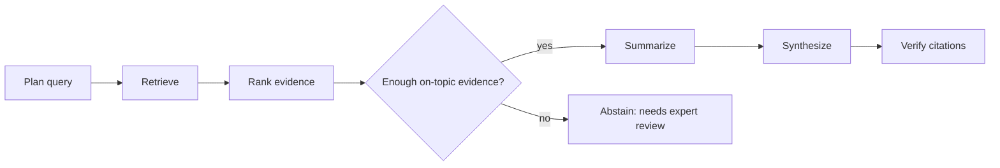

<div align="center">
  <h3 align="center">Medical Literature Research Agent</h3>
  <p align="center">
    Answers clinical questions from PubMed with ranked evidence and verified citations, and abstains when the evidence is too weak to answer.
  </p>
</div>

> **Disclaimer:** For research and demonstration only. Not medical advice, and not for clinical decision-making.

## About

Ask a clinical question in plain language, such as *"Do statins reduce major cardiovascular events in adults with coronary heart disease?"* The agent searches PubMed, ranks the evidence, and writes an answer in which every cited claim must match an exact sentence from its source abstract.

If it can't find enough on-topic evidence, it doesn't guess. It flags the question for expert review instead.

**Result:** on a 20-question clinical evaluation, this design reduced wrong answers from **8 to 0**.

Also supports study-type and date filters, treatment comparison, follow-up questions, PDF export, and ClinicalTrials.gov lookup.

### Built With

* [![Python][Python.org]][Python-url]
* [![FastAPI][FastAPI.tiangolo.com]][FastAPI-url]
* [![LangGraph][LangGraph]][LangGraph-url]
* [![Groq][Groq.com]][Groq-url]
* [![React][React.js]][React-url]

## How It Works



1. **Plan query.** The model extracts the question's PICO elements (population, intervention, comparator, outcome). Code builds the PubMed query from them and validates every MeSH term against NCBI's official vocabulary, so the model can't introduce invalid search terms.
2. **Retrieve.** Searches systematic reviews and randomized trials together. If a query returns fewer than 5 results, a broader keyword query also runs. Retracted papers are excluded.
3. **Rank evidence.** The model scores each paper's relevance from 0 to 2. Papers are ranked by relevance, then by study design from PubMed metadata.
4. **Abstain gate.** If fewer than 2 of the top 4 papers are fully on topic, the agent returns *"needs expert review"* instead of an answer.
5. **Summarize.** Each kept paper is summarized into the same fields: population, intervention, comparator, outcome, effect direction, and significance.
6. **Synthesize.** States the conclusion supported by most of the higher-quality evidence, and notes conflicting results.
7. **Verify citations.** Each cited claim must quote an exact sentence from its abstract (after normalizing punctuation and British/American spelling). Unsupported claims are removed.

**Confidence score.** Combines the kept papers' relevance with the share of claims that pass verification, on a 0–100 scale: High 75+, Moderate 50+, Low below 50. Abstained answers have no score.

## Evaluation

20 clinical questions with well-established evidence, each with a reference conclusion. Answers are graded **correct**, **abstained**, or **wrong**.

| Metric | Before abstain gate | Current |
| --- | --- | --- |
| Correct | 11 | 12 |
| Abstained | 0 | 8 |
| **Wrong** | **8** | **0** |
| Citation validity | 100% (25/25) | 100% (44/44) |
| Claim support | 83% (24/29) | 84% (31/37) |

Both runs used `openai/gpt-oss-20b` on Groq. The earlier run completed 19 of 20 questions due to a rate-limit error.

```sh
python -m pytest tests/          # 31 tests
python eval/run_eval.py --subset # 5 hard questions
python eval/run_eval.py          # full evaluation
```

## Experiments

**Looser abstain gate.** Requiring one on-topic paper instead of two would have answered 5 more questions, but 3 of those answers were wrong. The stricter gate was kept: a confident wrong answer is worse than flagging a question for review.

**Query broadening.** Widening searches that returned few results scored 9 correct, 10 abstained, and 1 wrong. Broader queries pulled in studies from the wrong patient population, so the change was reverted. Results: `eval/results_experiment_broadening.json`.

## Limitations

* Reads abstracts only, not full papers.
* Answers 12 of 20 evaluation questions; the rest abstain, mostly because retrieval didn't find enough on-topic papers.
* Responses take about two minutes, partly due to API rate limits.
* A 20-question evaluation set, so results are directional.
* Doesn't formally grade study quality or risk of bias.

## Getting Started

Requires Python 3.10+, Node.js, and a [Groq API key](https://console.groq.com).

```sh
git clone https://github.com/sanskritim05/medical-literature-research-agent.git
cd medical-literature-research-agent

python -m venv .venv
source .venv/bin/activate
pip install -r requirements.txt

cp .env.example .env   # then add your GROQ_API_KEY

cd web && npm install && npm run build && cd ..
uvicorn main:app --reload
```

Open `http://127.0.0.1:8000`.

Optional `.env` settings: `GROQ_MODEL` (default `openai/gpt-oss-20b`) and `NCBI_API_KEY`, which raises PubMed's rate limit.

## Example Questions

* Do statins reduce major cardiovascular events in adults with coronary heart disease?
* Do SGLT2 inhibitors reduce heart failure hospitalization in patients with reduced ejection fraction?
* Does the influenza vaccine reduce influenza illness in adults?
* Do inhaled corticosteroids reduce asthma exacerbations?

**Example of an abstention:** *"In adults with acute low back pain, do NSAIDs improve pain and function compared with acetaminophen?"* The agent flags this for expert review, because fewer than two retrieved papers directly compare the two treatments.

## Project Structure

```text
├── main.py               # FastAPI app
├── agent.py              # Pipeline, ranking, abstain gate, verifier
├── pubmed_tool.py        # PubMed and MeSH search, caching
├── eval/
│   ├── run_eval.py       # Evaluation runner and grader
│   └── results*.json     # Current, baseline, subset, and experiment results
├── tests/                # 31 tests
└── web/                  # React frontend (Vite)
```

[Python.org]: https://img.shields.io/badge/Python-3776AB?style=for-the-badge&logo=python&logoColor=white
[Python-url]: https://python.org
[FastAPI.tiangolo.com]: https://img.shields.io/badge/FastAPI-009688?style=for-the-badge&logo=fastapi&logoColor=white
[FastAPI-url]: https://fastapi.tiangolo.com
[LangGraph]: https://img.shields.io/badge/LangGraph-1C3C3C?style=for-the-badge&logo=langchain&logoColor=white
[LangGraph-url]: https://github.com/langchain-ai/langgraph
[Groq.com]: https://img.shields.io/badge/Groq-F55036?style=for-the-badge&logoColor=white
[Groq-url]: https://groq.com
[React.js]: https://img.shields.io/badge/React-20232A?style=for-the-badge&logo=react&logoColor=61DAFB
[React-url]: https://react.dev